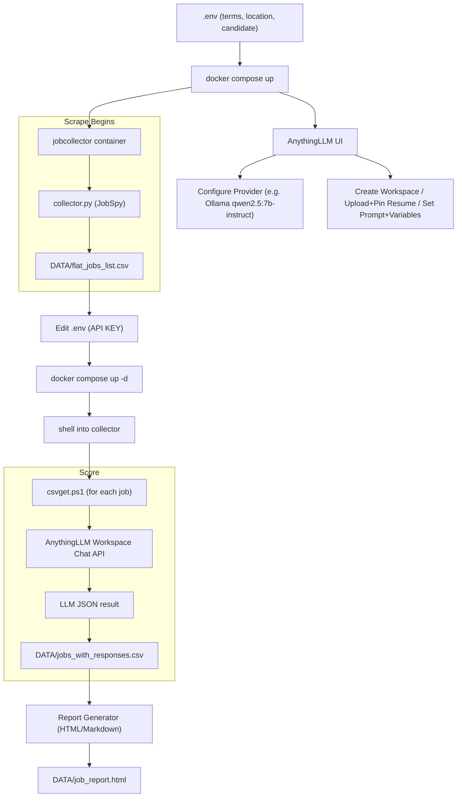
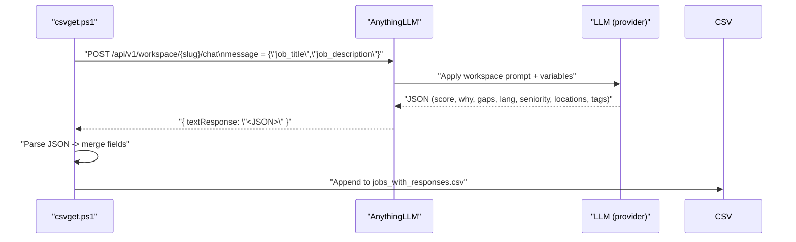
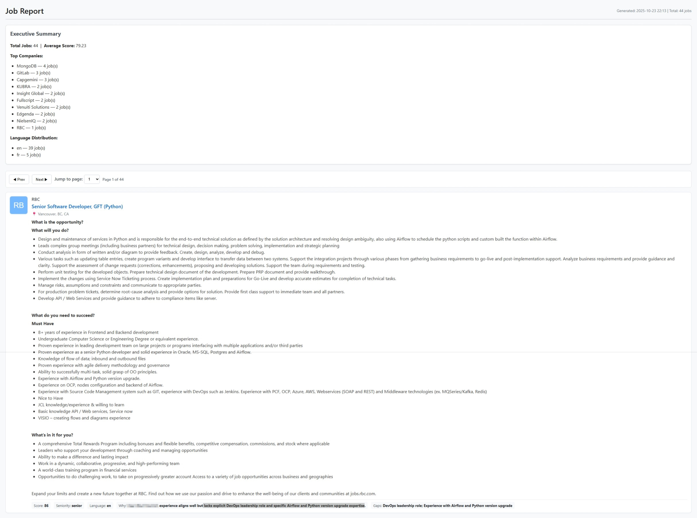

# Job Search Automation Tool

Scrape fresh job postings, enrich them with AI scoring, and save everything to CSV. This repository ships  Docker Compose stacks with 2-3 services:

* **AnythingLLM**: the UI and API gateway for your LLM.
* **jobcollector**: a Python+PowerShell worker that scrapes jobs and asks the LLM to evaluate fit.
* **OLLAMA LLM** (optional)


**BE SURE TO READ THE WHOLE DOC**. Otherwise you may have to start all over.

## Contents

- [Job Search Automation Tool](#job-search-automation-tool)
  - [Contents](#contents)
  - [Prerequisites](#prerequisites)
- [TL;DR Basic system workflow](#tldr-basic-system-workflow)
  - [Per-job scoring sequence:](#per-job-scoring-sequence)
  - [1. The stack](#1-the-stack)
    - [We've included 3 docker compose files:](#weve-included-3-docker-compose-files)
  - [2. Bring the stack up](#2-bring-the-stack-up)
    - [After `.env` is saved and the stack is running, **it should automatically start a scraping collecting jobs.**](#after-env-is-saved-and-the-stack-is-running-it-should-automatically-start-a-scraping-collecting-jobs)
  - [3. Add your models to ollama (if you decided to run those locally)](#3-add-your-models-to-ollama-if-you-decided-to-run-those-locally)
  - [4. Point AnythingLLM to your LLM](#4-point-anythingllm-to-your-llm)
  - [5. Edit the workspace](#5-edit-the-workspace)
  - [6. Generate an **API Key**: **Settings → API Keys → Create**. Copy the token.](#6-generate-an-api-key-settings--api-keys--create-copy-the-token)
  - [7. Note the **workspace slug** in the URL bar when inside the workspace](#7-note-the-workspace-slug-in-the-url-bar-when-inside-the-workspace)
  - [8. Configure the containers via `.env`](#8-configure-the-containers-via-env)
    - [What the worker sends to your LLM](#what-the-worker-sends-to-your-llm)
  - [9. Run the data flow](#9-run-the-data-flow)
  - [11. Data outputs](#11-data-outputs)
  - [12. Revewing the Data](#12-revewing-the-data)
  - [13. Troubleshooting](#13-troubleshooting)
  - [14. About Performance.](#14-about-performance)
  - [Credits](#credits)
  - [Ethical \& legal considerations](#ethical--legal-considerations)


---

## Prerequisites

* Docker and Docker Compose
* A running LLM provider reachable by AnythingLLM. Options include:

  * **OpenAI** compatible APIs
  * **Anthropic**
  * **Ollama** at `http://host.docker.internal:11434` or a LAN host
  * **Local/other HTTP** model endpoints supported by AnythingLLM


---

# TL;DR Basic system workflow


## Per-job scoring sequence:



## 1. The stack

### We've included 3 docker compose files:

- **The "ideal" one** is the regular docker-compose.yml file. It contains everything you need incliding OLLAMA for the nvidia GPU
- **The CPU runner** again includes OLLAMA but runs it on your cpu. On a i9 11th Generation at 8 cores, it's 9 to 16 times slower than a GPU.
- **The Vanilla** One doesn't include ollama at all. Supposing that you are hosting a completely different LLM or model elsewhere. We haven't tested all of these, of course.


> Tip: If you use Ollama on the same host, expose it on `0.0.0.0:11434` and set the provider in AnythingLLM to "Ollama" with that base URL.

---

## 2. Bring the stack up

Edit your .env now; you will come back to add ANLLM_API_KEY after step 6

```bash
cp .env.example "/compose files/.env"
nano .env

docker compose up [-f] [docker-compose-file] -d --build
```

* AnythingLLM UI: [http://localhost:3001](http://localhost:3001)
* Data directory: `./data` is mounted at `/DATA` in the worker container.
### After `.env` is saved and the stack is running, **it should automatically start a scraping collecting jobs.**
  >This will give you time to perform the other steps.
---

## 3. Add your models to ollama (if you decided to run those locally)
Go into the docker container
```bash
docker exec -ti ollama /bin/bash/
```
At the prompt pull the models:
```bash
root@bec53fa8236f:/> ollama pull llama3.2:3b-instruct-q6_K && ollama pull nomic-embed-text:v1.5 && ollama pull qwen2.5:7b
```
These images are some 10 GBytes in total, so be patient.


## 4. Point AnythingLLM to your LLM

Open the AnythingLLM UI and complete first‑run setup. The onboarding:


1. Choose a provider and set credentials and base URL.

   * OpenAI‑compatible: set API key and choose a default model.
   * Anthropic: set API key and default model.
   * Ollama: set Base URL to where Ollama is reachable, for example `http://ollama:11434`, then select a local model.
1. Create a workspace. 
  * Suggested name: `job-searching` (matches the default `.env`), but any name works. You just need to adjust your .env file.


Suggested local model for strict JSON scoring: **`qwen2.5:7b-instruct`** (Ollama). It tends to follow “JSON only, no prose” prompts reliably while staying fast on mid‑range GPUs and ARM boards. If you have a less powerful GPU we suggest using the **`llama3.2:3b-instruct-q6_K`** model, for ollama.

---

## 5. Edit the workspace


We want the evaluator to always have the candidate resume in context, and the **scoring prompt lives in the workspace**. The worker only sends one message containing the job JSON.

1. In the UI go to **Workspaces → select the document icon**(left icon).
 
   1. Click **Upload** and add the candidate resume (PDF, Markdown, or text). Wait for indexing to finish.
   1. Move the resume
   1. **Pin** the resume so it always stays in the conversation context for this workspace.


Next we will istruct the evaluator how to do it's job:

1. In the UI go to **Workspaces → select the Gear icon** .
   1. Go into `Chat Settings`
   2. Select the text below and paste it in in the `System prompt`box.
   3. Save it.
```
You are a strict job-fit scorer. Return ONLY valid JSON; no prose, no code fences.

INPUT_JOB_JSON:
{{job_json}}   # e.g. {"job_title":"...", "job_description":"..."}

CRITERIA:
must = {{must_haves}}              # e.g. ["Zero Trust","Azure","SecArch","French"]
nice = {{nice_to_haves}}           # e.g. ["GRC","Kubernetes","Bicep","IAM"]
exclude = {{exclusions}}           # e.g. ["SAP","Mainframe"]
locale = {{locale}}                # e.g. ["Montréal","Québec","Canada","Remote-Canada"]
lang_pref = {{lang_pref}}          # "fr"|"en"|"either"
seniority_target = {{seniority}}   # "senior"|"lead"|"mid"

SCORING
- score ∈ [0,100]
- must hits = 60% weight (divide evenly)
- nice hits = 30% weight (divide evenly)
- risks = −10 each: excludes hits, wrong seniority, wrong locale, wrong language, contractor-only, relocation required
- clamp to [0,100]

EXTRACT (from title+description only)
- lang: "fr"|"en"|"mixed"
- seniority: "junior"|"mid"|"senior"|"lead"
- locations: list of places in the text (normalize city/region/country; include "Remote" if stated)
- tags: up to 8 short tokens (e.g., ["azure","zerotrust","grc","k8s","iam","gov", "devops","secdevops"])
- gaps: must items not found (exact strings from must)

OUTPUT JSON SCHEMA (and nothing else):
{
  "score": int,
  "why": "≤40 words concise reason",
  "gaps": [string],
  "lang": "fr|en|mixed",
  "seniority": "junior|mid|senior|lead",
  "locations": [string],
  "tags": [string]
}
```


## 6. Generate an **API Key**: **Settings → API Keys → Create**. Copy the token.
Go and edit your .env file. Bring your stack back up. If the collector is working, let it finish.
## 7. Note the **workspace slug** in the URL bar when inside the workspace 
(e.g., /workspace/`job-searching`). You will need this in `.env`.


---

## 8. Configure the containers via `.env` 

Edit `.env` and set the following. All values are consumed by `docker-compose.yml` and passed to the worker container.

```dotenv
# AnythingLLM service
ANYTHINGLLM_PORT=3001
ANLLM_API_BASE=http://anythingllm:3001
ANLLM_API_WORKSPACE=job-searching   # use your workspace slug
ANLLM_API_KEY=[YOU ANYTHING LLM API KEY] #do not save this in a repo or in an insecure location

# Candidate identity used for logs and context naming
CANDIDATE_NAME="John Doe"  # as it appears in your resume

# Scraper "knobs"
SITE_NAME=indeed,linkedin,glassdoor
SEARCH_TERMS="Azure,devops" #the search will loop for as many terms you choose.
LOCATION=Canada
RESULTS_WANTED=50
HOURS_OLD=24
COUNTRY_INDEED=canada
LINKEDIN_FETCH_DESCRIPTION=true

# Evaluator behavior
RETRIES=3
TIMEOUT_MINUTES=5
```

### What the worker sends to your LLM

* A single message payload to the AnythingLLM workspace chat API with **only** this JSON string as `message`:

  * `{ "job_title": "...", "job_description": "..." }`
* All scoring rules and criteria live in the **workspace prompt** and its **Prompt variables**; nothing prompt-related is sent from the container.
  >**Important note:** The structure of the prompt and the suggested JSON makes a big difference on the quality of the data and how it can later be evaluated as an actual good proposal.

---

## 9. Run the data flow

If you want to run the scraping job manually:

  1. **Manually Scraping jobs** into CSV

    ```bash
    docker compose exec jobcollector pwsh -c "python3 /app/collector.py --results 100"
    ```

    This writes `./data/flat_jobs_list.csv`.

    Example Output:
    

  2. **Evaluate each job** with the LLM

    ```bash
    docker compose exec jobcollector pwsh -f /app/csvget.ps1
    ```

    This reads `flat_jobs_list.csv`, calls the AnythingLLM workspace chat API, and writes `./data/jobs_with_responses.csv` including `score`, `why`, and `gaps` columns.

    Example Output:
    

  3. **Iterate**

     * Adjust search knobs in `.env` and re-run the collector.
     * Tune the workspace Prompt variables (`must_haves`, `nice_to_haves`, `exclusions`, `locale`, `lang_pref`, `seniority`).

---

## 11. Data outputs

* `DATA/flat_jobs_list.csv` — raw scraped postings
* `DATA/jobs_with_responses.csv` — postings with AI-derived columns (if there are existing lists they will be renamed at exec time)

---

## 12. Revewing the Data

A Utility script is included to generate a report:

```
PS> .\New-JobReport.ps1 `
  -CsvPath './data/jobs_with_responses_20251023_211848.csv' `
  -OutputHtmlPath './data/jobs_report.html' `
  -PageSize 1
```
This generates an executive report to help you review the data


## 13. Troubleshooting

* **AnythingLLM cannot reach your provider**

  * Recheck provider settings under **Settings → Providers** and test in Playground.
* **Worker cannot reach AnythingLLM**

  * Ensure `ANLLM_API_BASE` is `http://anythingllm:3001` inside the container. Do not use `localhost` from the worker.
* **No results in flat_jobs_list.csv**

  * Increase `RESULTS_WANTED` or `HOURS_OLD`, and vary `SEARCH_TERM` and `LOCATION`.
* **JSON parsing errors or non‑JSON chatter**

  * Ensure the workspace prompt says “Return ONLY valid JSON; no prose, no code fences.” Prefer `qwen2.5:7b` on Ollama.
* **Resume not used by the LLM**

  * Confirm the resume is uploaded in the correct workspace and is pinned.
* **Auth errors**

  * Verify `ANLLM_API_KEY` and that `ANLLM_API_WORKSPACE` matches the slug shown in the UI.

## 14. About Performance.

For reference a GTX 3080 GPU with **`qwen2.5:7b-instruct`** returns answers at a rate, per job, one per 20 seconds. 
A GTX 1660 Super or a GTX 1650 mobile gets you about 45 seconds per job with a model half that size (**`llama3.2:3b-instruct-q6_K`**). And the `reliability` if that model is lower. Its scoring is sometime more, flakey. So review the data carefully. 

>Note: don't be surprised if the read rate slows down after a few automated job reviews. A moving `context window` is created in the workspace and the chat bot reuses it. So this data is also `considered` by the LLM. It will grow a bit, then stabilize. So if you got a quick reponse for the first few rows, it may double.

## Credits
This project includes code or inspiration from open-source projects:

- [JobSpy](https://github.com/jobspy/jobspy) © 2023 Lucas Villalobos — Licensed under the MIT License.
Huge thank you for getting that done.

## Ethical & legal considerations

Please see [docs/ETHICS.md¸](./docs/ETHICS.md) for guidance on legal compliance, candidate privacy, secure handling of API keys and secrets, model limitations, and recommended operational safeguards. This project is intended for lawful, responsible use; do not use it to violate terms of service, scrape sites that prohibit automated access, or make automated hiring decisions without human review.