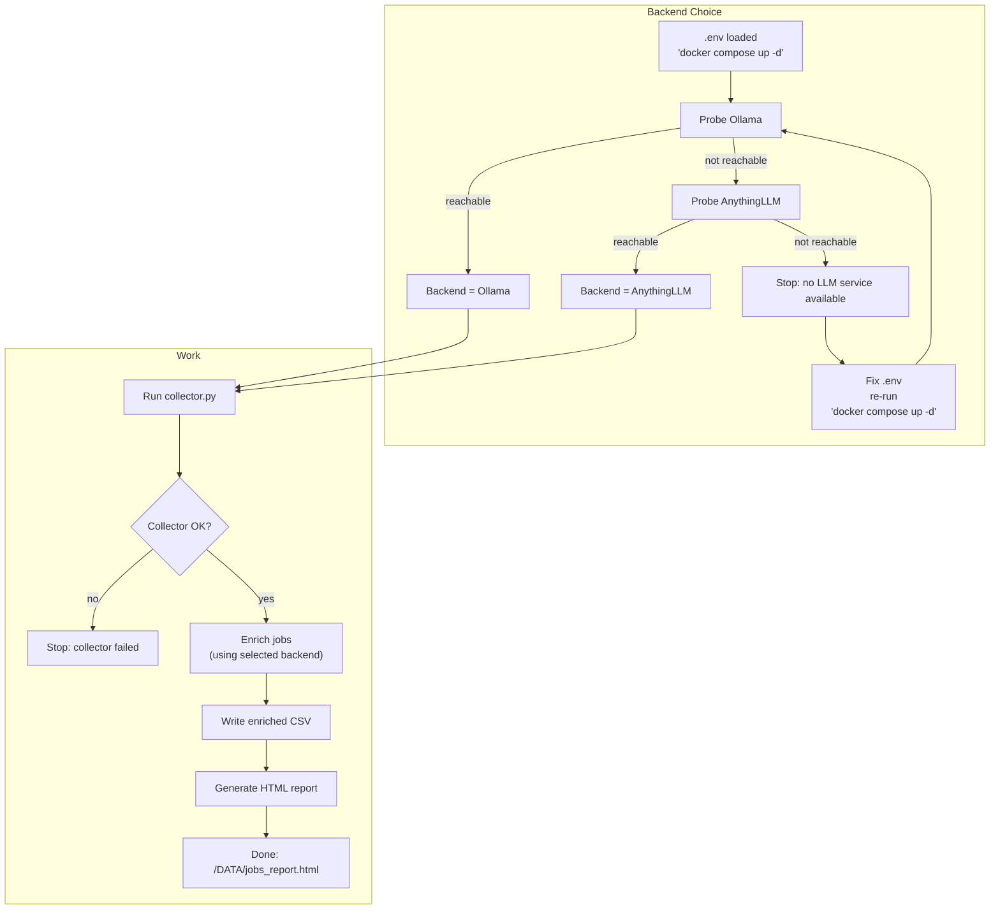
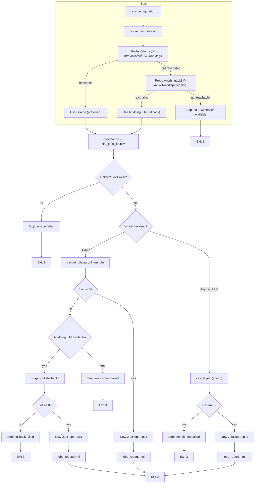
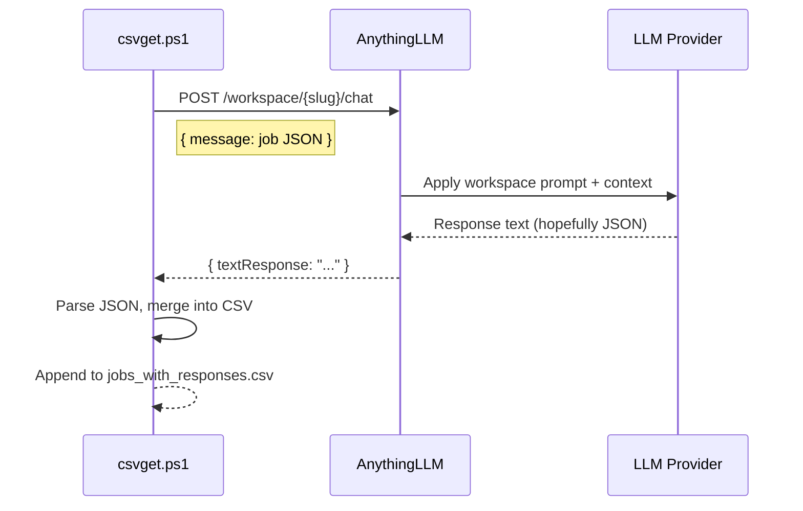
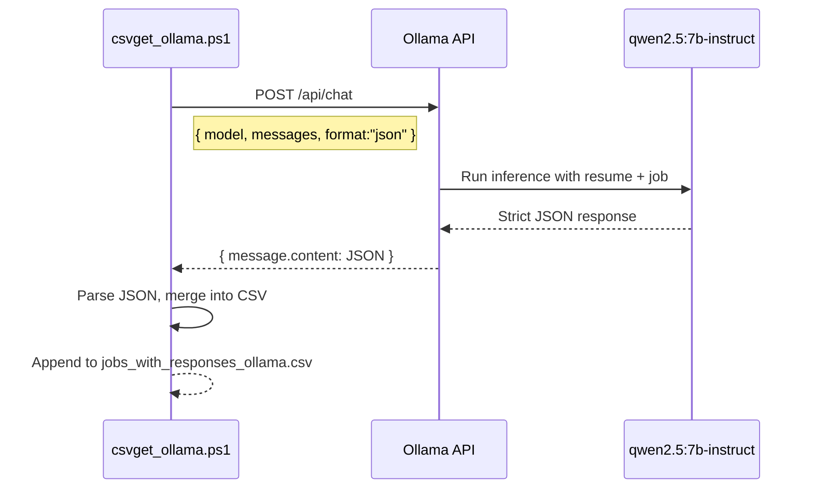

# Job Search Automation Tool

>Alpha 004 version.

Scrape fresh job postings, enrich them with AI scoring, and save everything to CSV and HTML reports. This repository provides Docker Compose stacks with 2-3 services that work together to automate job hunting.
See the [Compose README.md](./compose%20files/README.md)

## What This Does

1. **Scrapes** job postings from Indeed, LinkedIn, and Glassdoor
2. **Scores** each job against your resume and preferences using AI
3. **Generates** a beautiful HTML report with pagination and filtering

**READ THIS ENTIRE DOCUMENT** before starting. The setup order matters!


---

## Contents

- [Job Search Automation Tool](#job-search-automation-tool)
  - [What This Does](#what-this-does)
  - [Contents](#contents)
  - [Prerequisites](#prerequisites)
  - [Architecture Overview](#architecture-overview)
    - [Backend Options](#backend-options)
    - [How Backend Selection Works](#how-backend-selection-works)
  - [Flow Diagrams](#flow-diagrams)
    - [Simplified Execution Flow](#simplified-execution-flow)
    - [Detailed Call Flow](#detailed-call-flow)
    - [AnythingLLM Scoring Sequence](#anythingllm-scoring-sequence)
    - [Ollama Scoring Sequence](#ollama-scoring-sequence)
  - [Quick Start](#quick-start)
    - [Step 1: Choose Your Stack](#step-1-choose-your-stack)
    - [Step 2: Prepare Your Environment](#step-2-prepare-your-environment)
    - [Step 3: Start the Stack](#step-3-start-the-stack)
  - [Backend-Specific Setup](#backend-specific-setup)
    - [Option A: Ollama Setup (Recommended for Privacy/Performance)](#option-a-ollama-setup-recommended-for-privacyperformance)
    - [Option B: AnythingLLM Setup (Recommended for Flexibility)](#option-b-anythingllm-setup-recommended-for-flexibility)
    - [Option C: Both Backends (Recommended for Reliability)](#option-c-both-backends-recommended-for-reliability)
  - [Configuration Reference](#configuration-reference)
    - [Environment Variables Explained](#environment-variables-explained)
    - [Scoring Criteria Configuration](#scoring-criteria-configuration)
  - [Running the Pipeline](#running-the-pipeline)
    - [Automatic Execution (Default)](#automatic-execution-default)
    - [Manual Execution](#manual-execution)
  - [Understanding the Output](#understanding-the-output)
    - [CSV Files](#csv-files)
    - [HTML Report](#html-report)
  - [Troubleshooting](#troubleshooting)
    - [Common Issues](#common-issues)
    - [Backend Selection Problems](#backend-selection-problems)
    - [Scoring Quality Issues](#scoring-quality-issues)
  - [Performance Notes](#performance-notes)
    - [GPU Recommendations `CONTEXT_LENGTH=16384`](#gpu-recommendations-context_length16384)
    - [Model Selection Guide](#model-selection-guide)
  - [Analysis notes.](#analysis-notes)
  - [Advanced Configuration](#advanced-configuration)
    - [Custom Prompt Engineering](#custom-prompt-engineering)
    - [Multiple Search Terms](#multiple-search-terms)
- [Credits](#credits)
- [Ethical \& Legal Considerations](#ethical--legal-considerations)
- [TODO](#todo)

---

## Prerequisites

**Required:**
- Docker and Docker Compose
- 16GB+ RAM (8GB might work for small batches)
- Storage for models (10-30GB depending on choices)

**One of the following:**
- NVIDIA GPU with CUDA support (for local Ollama)
- CPU with 8+ cores (slower local Ollama)
- API keys for OpenAI/Anthropic/other providers (for AnythingLLM)

**For local GPU inference:**
- NVIDIA Container [Toolkit installed](https://docs.nvidia.com/datacenter/cloud-native/container-toolkit/latest/install-guide.html#configuring-docker)
- GPU with 6GB+ VRAM for 3B models, 12GB+ for 7B models

>Note: Some "Mobile" GPUs fallback to shared VRAM after 8 or 4 GB. This usually works well too.

---

## Architecture Overview

### Backend Options

This tool supports **two AI backends** for job scoring:

| Backend | Pros | Cons | Best For |
|---------|------|------|----------|
| **Ollama** | Fast, private, no API costs, strict JSON | Requires GPU/CPU resources, setup time | Privacy-conscious users, high volume |
| **AnythingLLM** | Flexible providers, cloud or other hosted models, easy setup | possible API costs, potentially less reliable JSON, potential privacy concerns | Flexibility of LLMs, secure local or cloud  setups. <br/>It should be noted that you could use this for other purposes of your own. |

### How Backend Selection Works

On startup, the automation script (`flow.ps1`) **automatically detects** which backend to use:

1. **First choice:** Ollama 
2. **Fallback:** AnythingLLM (if API key configured and reachable)
3. **Stop:** If neither backend is available

**Fallback behavior:** If Ollama detetion fails, the system automatically tries AnythingLLM as a backup (if configured).

---

## Flow Diagrams

### Simplified Execution Flow



### Detailed Call Flow



### AnythingLLM Scoring Sequence



### Ollama Scoring Sequence



---

## Quick Start

### Step 1: Choose Your Stack

Three Docker Compose files are provided:

| File | GPU Support | Use Case |
|------|-------------|----------|
| `docker-compose.yml` | ✅ NVIDIA GPU | **Recommended** - Fast local inference |
| `docker-compose-cpu.yml` | ❌ CPU only | Slower but works anywhere |
| `docker-compose-vanilla.yml` | N/A (no Ollama, included) | Cloud or other hosted LLM only (OpenAI/Anthropic) |

**Most users should start with `docker-compose.yml`** (GPU version).

### Step 2: Prepare Your Environment

```bash
# Copy example environment file
cp .env.example .env

# Edit with your settings
nano .env  # or use your preferred editor
```

**Minimum required settings:**

```dotenv
# Data persistence (adjust to your local path)
DATA_DIR=/home/yourusername/DATA

# Job search parameters
SEARCH_TERMS="Azure devops,platform engineer,devsecops"
LOCATION=Canada
RESULTS_WANTED=100

# Your identity
CANDIDATE_NAME="Your Name"
```

### Step 3: Start the Stack

```bash
# For GPU users (default)
docker compose up -d --build

# For CPU users
docker compose -f docker-compose-cpu.yml up -d --build

# For cloud LLM only
docker compose -f docker-compose-vanilla.yml up -d --build
```

**What happens next:**
1. Containers start (Ollama, AnythingLLM, jobcollector)
2. Collector **immediately begins** scraping jobs
3. You continue setup while it runs in the background

---

## Backend-Specific Setup

### Option A: Ollama Setup (Recommended for Privacy/Performance)

**1. Pull the models** (while collector runs):

```bash
docker exec -it ollama ollama pull qwen2.5:7b-instruct
docker exec -it ollama ollama pull nomic-embed-text:v1.5
```

**Model size:** ~10GB total. On a GTX 3080, this takes 5-10 minutes.

**2. Prepare your resume:**

```bash
# Create resume directory
mkdir -p ./data/resume

# Copy your resume as plain text (2-3 pages max)
cp ~/my-resume.txt ./data/resume/resume.txt
```

**Format tips:**
- Plain text format (.txt)
- Keep under 10KB (~2-3 pages)
- Remove formatting, use clear section headers
- Focus on skills, tools, achievements

**3. Configure scoring criteria in `.env`:**

```dotenv
OLLAMA_BASE=http://ollama:11434
SCORER_MODEL=qwen2.5:7b-instruct
CANDIDATE_RESUME_PATH=/DATA/resume/resume.txt

# Define your scoring criteria
MUST_HAVES=Azure,DevOps,Remote
NICE_TO_HAVES=GRC,Docker,Bicep,PowerShell,Kubernetes
EXCLUSIONS=SAP,Mainframe,COBOL
LOCALE=Montreal,Quebec,Canada,Remote-Canada
LANG_PREF=either  # Options: fr, en, either
SENIORITY_TARGET=senior  # Options: junior, mid, senior, lead
```

**4. Restart to apply changes:**

```bash
docker compose restart jobcollector
```

**You're done!** Ollama will be used automatically. Skip to [Running the Pipeline](#running-the-pipeline).

---

### Option B: AnythingLLM Setup (Recommended for Flexibility)

**1. Open the UI:**

Browse to [http://localhost:3001](http://localhost:3001)

**2. Complete first-run setup:**

Choose your LLM provider:

**For OpenAI:**
- Provider: OpenAI
- API Key: `sk-...`
- Default Model: `gpt-4o-mini` (good balance of cost/quality)

**For Anthropic:**
- Provider: Anthropic
- API Key: `sk-ant-...`
- Default Model: `claude-3-5-sonnet-20241022`

**For local Ollama (if running):**
- Provider: Ollama
- Base URL: `http://ollama:11434`
- Model: `qwen2.5:7b-instruct`

**3. Create workspace:**

- Name: `job-searching` (or customize, then update `.env`)
- Click **Create**

**4. Upload your resume:**

- Click the **document icon** (left sidebar)
- **Upload** your resume (PDF, .txt, or .md)
- Wait for "Indexed" status
- Click **Pin icon** next to your resume to keep it in context

**5. Configure the scoring prompt:**

- Click the **gear icon** (workspace settings)
- Navigate to **Chat Settings**
- Paste this into **System Prompt:**

```
You are a strict job-fit scorer. Return ONLY valid JSON; no prose, no code fences.

INPUT_JOB_JSON:
{{job_json}}

RESUME_CONTEXT:
The candidate's resume is already in this conversation context. Use it for scoring.

SCORING CRITERIA:
must = {{must_haves}}              # e.g. ["Azure","DevOps","Remote"]
nice = {{nice_to_haves}}           # e.g. ["GRC","Kubernetes","Bicep"]
exclude = {{exclusions}}           # e.g. ["SAP","Mainframe"]
locale = {{locale}}                # e.g. ["Montreal","Quebec","Canada"]
lang_pref = {{lang_pref}}          # "fr"|"en"|"either"
seniority_target = {{seniority}}   # "senior"|"lead"|"mid"|"junior"

SCORING LOGIC:
- score ∈ [0,100]
- must hits = 60% weight (divide evenly among items)
- nice hits = 30% weight (divide evenly among items)
- penalties = −10 each for:
  * exclude items found
  * wrong seniority level
  * wrong location/locale
  * wrong language
  * contractor-only position
  * relocation required

EXTRACT FROM JOB POSTING:
- lang: "fr"|"en"|"mixed"
- seniority: "junior"|"mid"|"senior"|"lead"
- locations: list of cities/regions/countries (include "Remote" if stated)
- tags: up to 8 relevant tech/skill tokens

OUTPUT SCHEMA (strict JSON, no other text):
{
  "score": int,
  "why": "concise 40-word explanation",
  "gaps": ["missing must-have items"],
  "lang": "fr|en|mixed",
  "seniority": "junior|mid|senior|lead",
  "locations": ["city", "region", "country"],
  "tags": ["tech", "skill", "tokens"]
}
```

- Click **Save**

**6. Set up prompt variables:**

- Still in workspace settings, go to **Prompt Variables**
- Add these variables (customize values):

```
must_haves: ["Azure", "DevOps", "Remote"]
nice_to_haves: ["GRC", "Docker", "Kubernetes", "PowerShell"]
exclusions: ["SAP", "Mainframe"]
locale: ["Montreal", "Quebec", "Canada", "Remote-Canada"]
lang_pref: "either"
seniority: "senior"
```

**7. Generate API key:**

- **Settings → API Keys → Create New**
- Copy the key (looks like `5RR5YS1-V2N4YWR-...`)

**8. Note your workspace slug:**

Look at the URL when in your workspace:
```
http://localhost:3001/workspace/job-searching
                                 ^^^^^^^^^^^^
                                 This is your slug
```

**9. Update `.env` with your credentials:**

```dotenv
ANLLM_API_BASE=http://anythingllm:3001
ANLLM_API_WORKSPACE=job-searching  # Your slug here
ANLLM_API_KEY=5RR5YS1-V2N4YWR-QZ79WBY-ZVBQK6T  # Your key here
```

**10. Restart to apply:**

```bash
docker compose restart jobcollector
```

**You're done!** AnythingLLM will be used if Ollama isn't available.

---

### Option C: Both Backends (Recommended for Reliability)

**Why both?**
- Ollama is tried first (faster, private, free)
- AnythingLLM is automatic fallback (if Ollama fails)
- Best of both worlds

**Setup:**
1. Follow **Option A** (Ollama) completely
2. Follow **Option B** (AnythingLLM) completely
3. Configure both sets of environment variables in `.env`

The system will automatically prefer Ollama, falling back to AnythingLLM if needed.

---

## Configuration Reference

### Environment Variables Explained

**Job Scraping:**

```dotenv
SITE_NAME=indeed,linkedin,glassdoor  # Which sites to scrape
SEARCH_TERMS="term1,term2,term3"     # Comma-separated searches
LOCATION=Canada                       # Geographic filter
RESULTS_WANTED=100                    # Max results per search term
HOURS_OLD=24                          # Max posting age in hours
COUNTRY_INDEED=canada                 # Indeed-specific country code
LINKEDIN_FETCH_DESCRIPTION=true       # Get full descriptions (slower)
```

**Ollama Configuration:**

```dotenv
OLLAMA_BASE=http://ollama:11434
SCORER_MODEL=qwen2.5:7b-instruct      # Scoring model
# EMBED_MODEL=nomic-embed-text:v1.5     # Deprecated
CANDIDATE_RESUME_PATH=/DATA/resume/resume.txt
TEMPERATURE=0.3                        # Lower = more consistent
CONTEXT_LENGTH=32768                   # Token limit (depends on GPU)
```

**AnythingLLM Configuration:**

```dotenv
ANLLM_API_BASE=http://anythingllm:3001
ANLLM_API_WORKSPACE=job-searching
ANLLM_API_KEY=your-api-key-here
RETRIES=3                             # API retry attempts
TIMEOUT_MINUTES=5                     # Per-request timeout
```

### Scoring Criteria Configuration

**For Ollama** (set in `.env`):

```dotenv
MUST_HAVES=Azure,Kubernetes,CI/CD
NICE_TO_HAVES=Terraform,Python,Go
EXCLUSIONS=Mainframe,SAP
LOCALE=Toronto,Ontario,Canada,Remote-Canada
LANG_PREF=en
SENIORITY_TARGET=senior
```

**For AnythingLLM** (set in workspace Prompt Variables - see Option B, step 6 above).

---

## Running the Pipeline

### Automatic Execution (Default)

When you start the stack, the collector **immediately begins**:

```bash
docker compose up -d
# Jobs are being collected now...
```

**Monitor progress:**

```bash
# Watch logs
docker compose logs -f jobcollector

# Check for output files
ls -lh ./data/
```

**Expected files:**
- `flat_jobs_list.csv` - Raw scraped jobs
- `jobs_with_responses.csv` or `jobs_with_responses_ollama.csv` - Scored jobs
- `jobs_report.html` - Interactive report

### Manual Execution

**Run collector only:**

```bash
docker compose exec jobcollector python3 /app/collector/collector.py --results 200
```

**Run scoring only** (requires existing `flat_jobs_list.csv`):

```bash
# Ollama
docker compose exec jobcollector pwsh -f /app/powershell_scripts/csvget_ollama.ps1

# AnythingLLM
docker compose exec jobcollector pwsh -f /app/powershell_scripts/csvget.ps1
```

**Generate report only:**

```bash
docker compose exec jobcollector pwsh -f /app/powershell_scripts/New-JobReport.ps1 \
  -CsvPath '/DATA/jobs_with_responses.csv' \
  -OutputHtmlPath '/DATA/jobs_report.html' \
  -PageSize 10
```

---

## Understanding the Output

### CSV Files

**`flat_jobs_list.csv`** - Raw scraping output:
- `site` - Source (indeed/linkedin/glassdoor)
- `title` - Job title
- `company` - Company name
- `location` - Job location
- `description` - Full job description
- `job_url` - Link to posting
- (other metadata columns)

**`jobs_with_responses.csv`** or **`jobs_with_responses_ollama.csv`** - Enriched output:
- All columns from above, plus:
- `score` - Match score (0-100)
- `why` - Concise explanation
- `gaps` - Missing must-have skills
- `lang` - Language (fr/en/mixed)
- `seniority` - Level (junior/mid/senior/lead)
- `locations` - Extracted locations
- `tags` - Key technologies/skills

### HTML Report

Open `./data/jobs_report.html` in your browser.

**Features:**
- Executive summary with stats
- Company logos (generated if not provided)
- Pagination controls
- Sortable by score
- Markdown rendering for descriptions
- Print-friendly layout

**Customization:**

```bash
# Change page size
docker compose exec jobcollector pwsh -f /app/powershell_scripts/New-JobReport.ps1 \
  -CsvPath '/DATA/jobs_with_responses.csv' \
  -OutputHtmlPath '/DATA/report_custom.html' \
  -PageSize 25

# Add custom column mappings
-ColumnMap @{ company='employer'; title='position' }
```

---

## Troubleshooting

### Common Issues

**"Output file already exists" error:**

```bash
# Remove old output
rm ./data/flat_jobs_list.csv
docker compose restart jobcollector
```

**No LLM service available:**

```bash
# Check Ollama
docker compose exec ollama ollama list

# Check AnythingLLM
curl http://localhost:3001/api/health

# Review configuration
docker compose exec jobcollector env | grep -E '(OLLAMA|ANLLM)'
```

**Collector finds 0 jobs:**

- Increase `RESULTS_WANTED`
- Broaden `SEARCH_TERMS`
- Expand `LOCATION` (try "Remote" or country names)
- Increase `HOURS_OLD`

### Backend Selection Problems

**Ollama preferred but AnythingLLM used instead:**

```bash
# Verify Ollama is reachable
docker compose exec jobcollector curl http://ollama:11434/api/tags

# Check logs
docker compose logs ollama | tail -20
```

**Both backends fail:**

```bash
# Check environment variables
docker compose exec jobcollector env | grep -E '(OLLAMA_BASE|ANLLM_API)'

# Verify API key
docker compose exec jobcollector curl -H "Authorization: Bearer $ANLLM_API_KEY" \
  http://anythingllm:3001/api/v1/workspace/$ANLLM_API_WORKSPACE
```

### Scoring Quality Issues

**JSON parsing errors:**

For **Ollama:**
- Ensure you're using `qwen2.5:7b-instruct` or `llama3.2:3b-instruct-q6_K`
- Lower `TEMPERATURE` to 0.1
- Reduce `CONTEXT_LENGTH` if getting cutoff errors

For **AnythingLLM:**
- Verify the system prompt includes "Return ONLY valid JSON; no prose"
- Try a different model (GPT-4 is more reliable than GPT-3.5)
- Check workspace prompt variables are set correctly

**Scores seem off:**

- Review your `MUST_HAVES` and `NICE_TO_HAVES` - are they too broad/narrow?
- Check the `why` field in CSV to understand scoring logic
- Adjust penalty values in the system prompt
- Ensure your resume emphasizes relevant skills

**Missing locations or tags:**

- Job descriptions might be truncated
- Set `LINKEDIN_FETCH_DESCRIPTION=true` for fuller descriptions
- Some sites provide limited metadata

---

## Performance Notes

### GPU Recommendations `CONTEXT_LENGTH=16384`

| GPU | Model Size | Speed (per job) | Notes |
|-----|------------|-----------------|-------|
| RTX 3080 (10GB) | 7B `qwen2.5:7b-instruct`| ~4 seconds | **Recommended** - Sweet spot |
| RTX 3060 (12GB) | 7B `qwen2.5:7b-instruct`| ~6 seconds | Good balance |
| GTX 1660 Super (6GB) | 3B  `llama3.2:3b-instruct-q6_K`| ~45 seconds | Usable, smaller model required |
| RTX 4090 (24GB) | 13B+ `qwen2.5:7b-instruct`| ~2 seconds | Overkill but fastest |
| CPU (i9 11th gen, 8 cores) | 3B  `llama3.2:3b-instruct-q6_K` | ~4-8 minutes | Very slow, not recommended, unless all night processing small lists |

### Model Selection Guide

**For Ollama:**

| Model | VRAM | Speed | JSON Reliability | Scoring Quality |
|-------|------|-------|------------------|-----------------|
| `qwen2.5:7b-instruct` | 8GB | Fast | ⭐⭐⭐⭐⭐ | ⭐⭐⭐⭐⭐ |
| `llama3.2:3b-instruct-q6_K` | 4GB | Faster | ⭐⭐⭐⭐ | ⭐⭐⭐⭐ |
| `llama3.1:8b-instruct` | 9GB | Medium | ⭐⭐⭐ | ⭐⭐⭐⭐⭐ |
| `mistral:7b-instruct` | 8GB | Fast | ⭐⭐⭐ | ⭐⭐⭐⭐ |

**For AnythingLLM:**

| Model | Cost | JSON Reliability | Scoring Quality |
|-------|------|------------------|-----------------|
| `gpt-4o-mini` | Low | ⭐⭐⭐⭐ | ⭐⭐⭐⭐⭐ |
| `gpt-4o` | Medium | ⭐⭐⭐⭐⭐ | ⭐⭐⭐⭐⭐ |
| `claude-3-5-sonnet` | Medium | ⭐⭐⭐⭐⭐ | ⭐⭐⭐⭐⭐ |
| `gpt-3.5-turbo` | Very Low | ⭐⭐⭐ | ⭐⭐⭐ |

**Context window considerations:**

Larger context = more of your resume and job description can be considered, but:
- Slower inference
- More VRAM required
- Potentially less focused
- Halving the context windows usually halves the time to process as well.

**Recommended settings:**
- `CONTEXT_LENGTH=8192` for 6GB VRAM
- `CONTEXT_LENGTH=16384` for 8-10GB VRAM
- `CONTEXT_LENGTH=32768` for 12GB+ VRAM

---

## Analysis notes.
If you haven't used LLMs a lot in the past, a good peice of advice when using it to analyze data, is to **reivew it all**. Reliability is an issue with these. They tend to "hallucinate" and come up with whacky decisions.

A good way to save time and detect these is to **review on outliers first**. 
- **In our case**: very good scores and very bad ones. These are the areas where hallucinations may cause you the most **"trouble"**.

If you have a final output document, you can ALSO submit it, to another LLM for review for "weird cases".

## Advanced Configuration

### Custom Prompt Engineering

**Ollama users:** Edit `/app/powershell_scripts/csvget_ollama.ps1` and modify the `$systemPrompt` variable.

**AnythingLLM users:** Edit the workspace system prompt in the UI (see Option B, step 5).

**Tips for better prompts:**
- Be explicit: "Return ONLY JSON, no prose"
- Use examples: Show the exact JSON structure you want
- Weight clearly: Specify exact percentages for scoring components
- Iterate: Test with 5-10 jobs, refine, repeat

### Multiple Search Terms

The `SEARCH_TERMS` variable supports comma-separated values:

```dotenv
SEARCH_TERMS="Azure DevOps,Platform Engineer,Site Reliability Engineer,DevSecOps"
```

The collector will:
1. Run a separate search for each term
2. Aggregate all results
3. Remove duplicates (by job URL)
4. Score everything together

**Strategy tips:**
- Use synonyms to catch variations
- Include location-specific terms if needed
- Don't overdo it - 3-5 terms is usually enough

---

# Credits

Thank you for preventing me from reinventing the wheel!

This project includes code and inspiration from

- **[JobSpy](https://github.com/jobspy/jobspy)** © 2023 Lucas Villalobos (MIT License) - Job scraping library
- **[AnythingLLM](https://github.com/Mintplex-Labs/anything-llm)** - LLM workspace and API gateway
- **[Ollama](https://github.com/ollama/ollama)** - Local LLM runtime.

---

# Ethical & Legal Considerations

**Before using this tool, please read [docs/ETHICS.md](./docs/ETHICS.md) for detailed guidance on:**

- Legal compliance (respect robots.txt, rate limits, **ToS**)
- Candidate privacy (secure your data and API keys)
- Model limitations (always human-review AI decisions)
- Responsible automation (don't spam, don't scrape excessively)

**Summary:**
- ✅ Use for personal job searching
- ✅ Respect **site rate limits**!
- ✅ Keep **API keys secure**
- ✅ Human-review all AI scores
- ❌ Don't use for hiring decisions without human oversight
- ❌ Don't violate site terms of service
- ❌ Don't share candidate data without consent

---

# TODO

- [ ] Test all scenarios
- [ ] Add support for more job boards (Monster, ZipRecruiter)
- [ ] Implement resume version tracking
- [ ] Add email notifications for high-scoring jobs
- [ ] Create web UI for configuration
- [ ] Support multiple resumes/personas
- [ ] Implement application status tracking

**Want to contribute?** Open an issue or PR on GitHub!

---

**Need help?** Open an issue with:
- Your `.env` (redact API keys)
- Relevant log output
- What you expected vs. what happened

**Star us on GitHub** if this helped your job search! ⭐
